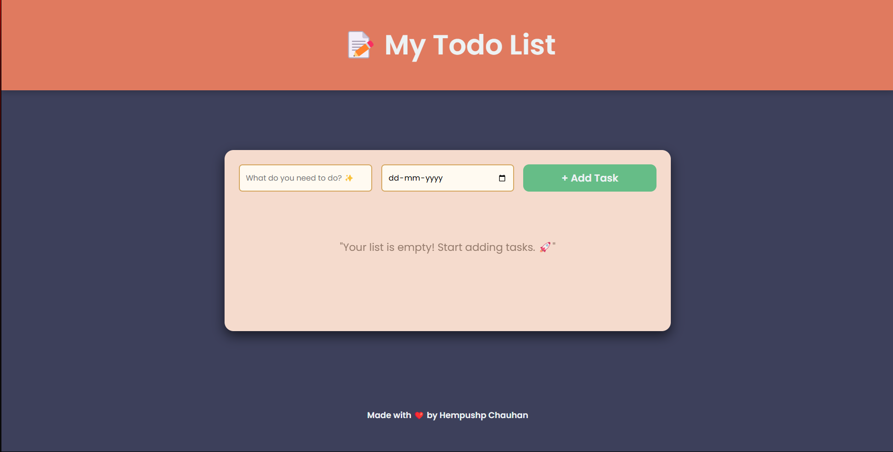

# Todo List App

A clean, simple and elegant Todo List web application to help you keep track of your tasks and deadlines.



## Features

- ✅ Add tasks with due dates
- 🗑️ Delete tasks easily
- 🔄 Reorder tasks with up/down controls
- 📱 Responsive design that works on all devices
- 🎨 Beautiful, modern UI with smooth animations
- ⚡ Lightweight and fast

## Technologies Used

- HTML5
- CSS3 (with Grid and Flexbox)
- Vanilla JavaScript

## How to Use

1. Enter your task in the text field
2. Select a due date
3. Click "Add Task" to add it to your list
4. Use the arrow buttons to reorder tasks
5. Click "Delete" to remove a task

## Local Development

1. Clone this repository
   ```
   git clone https://github.com/YOUR-USERNAME/todo-list-app.git
   ```
2. Open `index.html` in your browser

## Future Enhancements

- Local storage to persist tasks
- Task categories
- Dark mode toggle
- Mark tasks as complete
- Filter and search functionality

## Credits

Made by Hempushp Chauhan